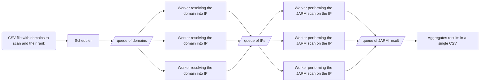

# Top-1M-jarm
This repo is used to compute the jarm values of top 1 millions website.  
[More info on jarm](https://engineering.salesforce.com/easily-identify-malicious-servers-on-the-internet-with-jarm-e095edac525a/).

## Output file template
| alexa rank | domain      | ip             | JARM hash                                                      |
|------------|-------------|----------------|----------------------------------------------------------------|
| 1          | google.com  | 216.58.213.78  | 29d3fd00029d29d21c42d43d00041df48f145f65c66577d0b01ecea881c1ba |
| 2          | youtube.com | 172.217.18.206 | 29d3fd00029d29d21c42d43d00041df48f145f65c66577d0b01ecea881c1ba |

## Architecture

## Set up
Run `poetry install` to install dependencies.  
This project use [PyO3](https://github.com/PyO3/pyo3) to bind rust code, to use it run `maturin develop --locked --release`  

## Running
Start redis with `docker-compose up`, start rq with `rq worker --with-scheduler --url redis://:XXX_SET_PASS_XXX@localhost:6379 --sentry-dsn XXX_SET_SENTRY_DSN_XXX`. Then start the scheduler with `poetry run top1Mjarm/scheduler.py`
