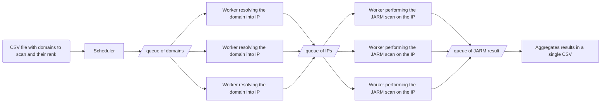

# Top-1M-jarm
This repo is used to compute the jarm values of top 1 millions website.  
[More info on jarm](https://engineering.salesforce.com/easily-identify-malicious-servers-on-the-internet-with-jarm-e095edac525a/).


## Output file template
| alexa rank | domain      | ip             | JARM hash                                                      |
|------------|-------------|----------------|----------------------------------------------------------------|
| 1          | google.com  | 216.58.213.78  | 29d3fd00029d29d21c42d43d00041df48f145f65c66577d0b01ecea881c1ba |
| 2          | youtube.com | 172.217.18.206 | 29d3fd00029d29d21c42d43d00041df48f145f65c66577d0b01ecea881c1ba |

## Architecture


## A batch of 1k domains being processed (RQ debug view)
As worker work on priority on the ip queue, few jobs stay in queue there
[](https://asciinema.org/a/547279)

## Set up for development
Run `poetry install` to install dependencies.  
This project use [PyO3](https://github.com/PyO3/pyo3) to bind rust code, to use it run `maturin develop --locked --release`  
To prepare local docker image run `docker build -t top-1m-jarm:latest .`  

## Running
This project use docker swarm (might require `docker swarm init`).  
One node has to be marked as a coordinator with:
`docker node update --label-add coordinator=1 $(docker node inspect --format '{{ .ID }}' self)`.  
It'll be responsible for input/output files.  
`result.csv` must also be created via touch (by default `touch ./data/result.csv`).  
```shell
docker stack deploy --compose-file docker-compose.yml top1MjarmStack
docker stack ls
docker service ls
docker service logs top1MjarmStack_scheduler -f
```

To monitor the queue:
```shell
docker exec -it $(docker ps -qf "name=top1MjarmStack_csv_writer" | head -n 1) poetry run rq info default domains ips jarm_result --url redis://:XXX_SET_REDIS_PASS_XXX@redis_queue:6379 -i 1
```

To remove the running containers:
```shell
docker stack rm top1MjarmStack
docker stack ls
```

## Push to docker hub
```shell
docker build -t hugocker/top-1m-jarm --pull --no-cache .
docker push hugocker/top-1m-jarm
```