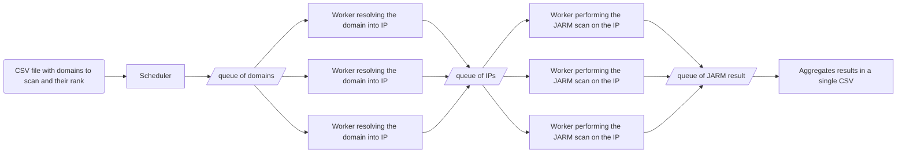

# Top-1M-jarm
This repo is used to compute the jarm values of top 1 millions website

## Architecture

## Set up
Run `poetry install` to install dependencies.  
This project use [PyO3](https://github.com/PyO3/pyo3) to bind rust code, to use it run `maturin develop --locked --release`  

## Running
Start redis with `docker-compose up`, start rq with `rq worker --with-scheduler --url redis://:XXX_SET_PASS_XXX@localhost:6379 --sentry-dsn XXX_SET_SENTRY_DSN_XXX`. Then start the scheduler with `poetry run top1Mjarm/scheduler.py`
